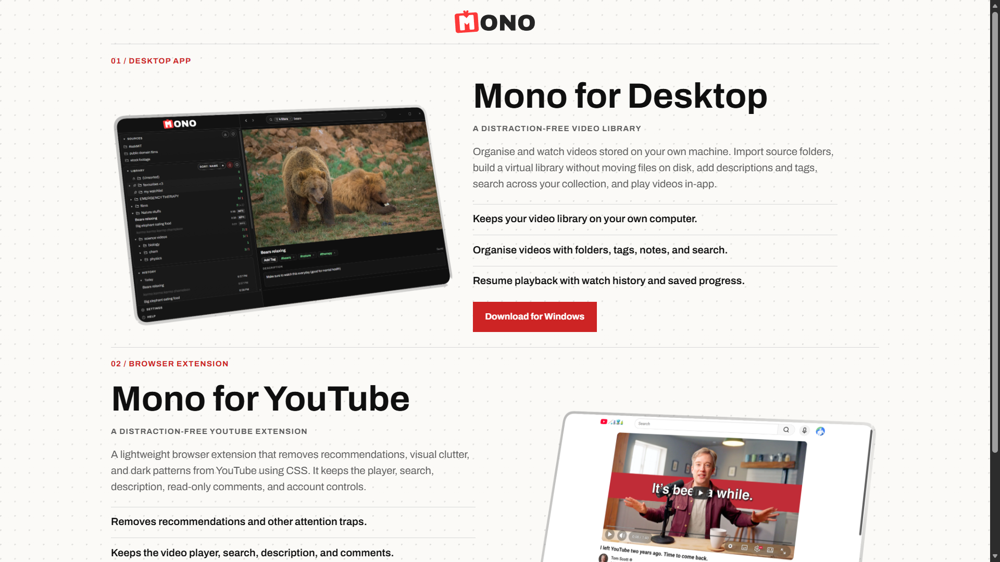
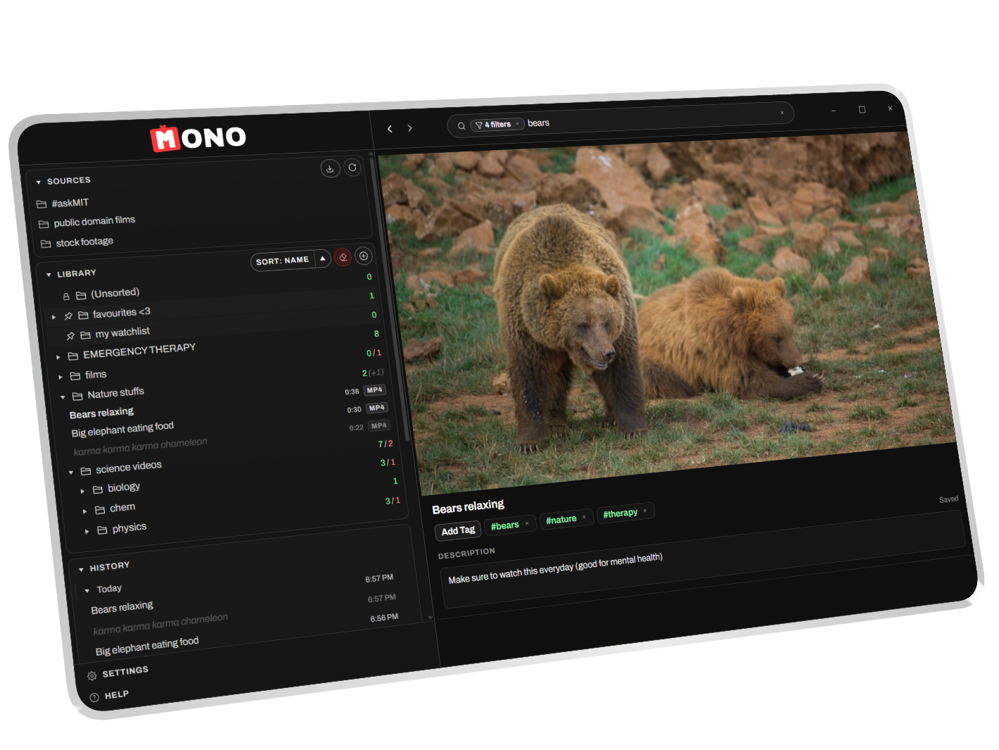
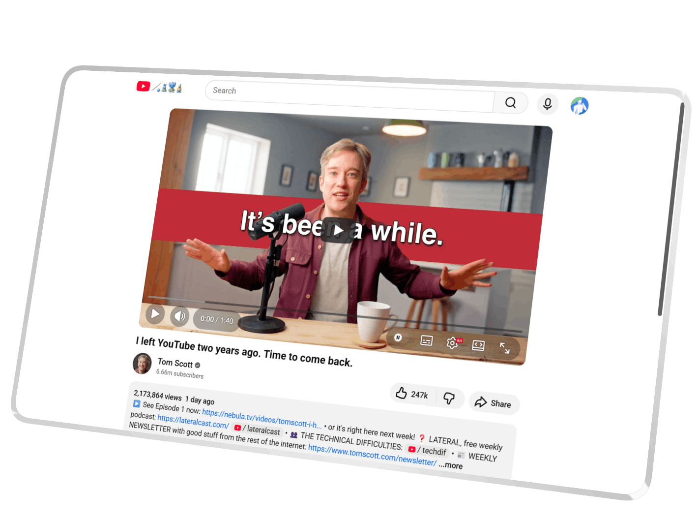

  

  Distraction-free software for watching, organising, and focusing on video.

  

## What Is Mono?

Mono is a small collection of calm, focused tools for video.

**Mono for Desktop** helps you organise and watch videos stored on your own computer. Build a clean local library, add folders, tags, and descriptions, then search and resume playback - all without touching what's on disk.

**Mono for YouTube** is a browser extension that removes recommendations, visual clutter, and attention traps from YouTube while keeping the parts you still need: the player, search, descriptions, comments, and account controls.

## Get Mono

| Product | Link |
| --- | --- |
| 🖥️ Mono for Desktop | [Download for Windows](https://github.com/Aadam-Gafar/Mono-Public-Dist/releases/download/v1.0.0/Mono.Video.Library_1.0.0_x64_en-US.msi) |
| 🌐 Mono for YouTube (Chrome) | [Install from the Chrome Web Store](https://chromewebstore.google.com/detail/focus-for-youtube/nppiofogichmlkadpbpkpojpidedifeh) |
| 🦊 Mono for YouTube (Firefox) | [Install from Firefox Add-ons](https://addons.mozilla.org/en-US/firefox/addon/mono-extension/) |

## Mono for Desktop

  

- Keep your video library on your own computer.
- Organise videos with folders, tags, notes, and search.
- Resume playback with watch history and saved progress.
- Build a virtual library without rearranging files on disk.

## Mono for YouTube

  

- Remove recommendations and other attention traps.
- Keep the video player, search, description, comments, and account controls.
- Run quietly without tracking you or adding extra clutter.
- Make YouTube feel more intentional.

## Contact

Questions, feedback, or support: [contact@monoapp.uk](mailto:contact@monoapp.uk)
